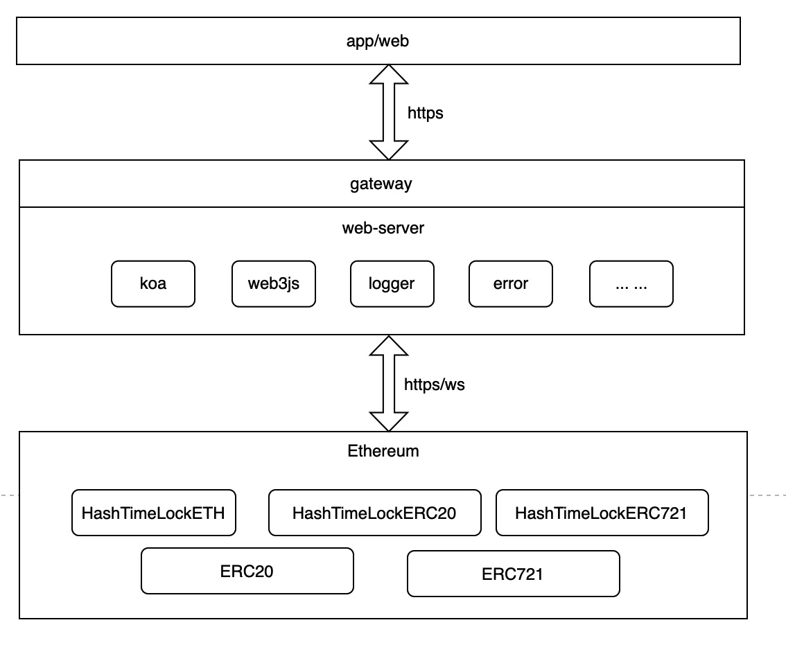
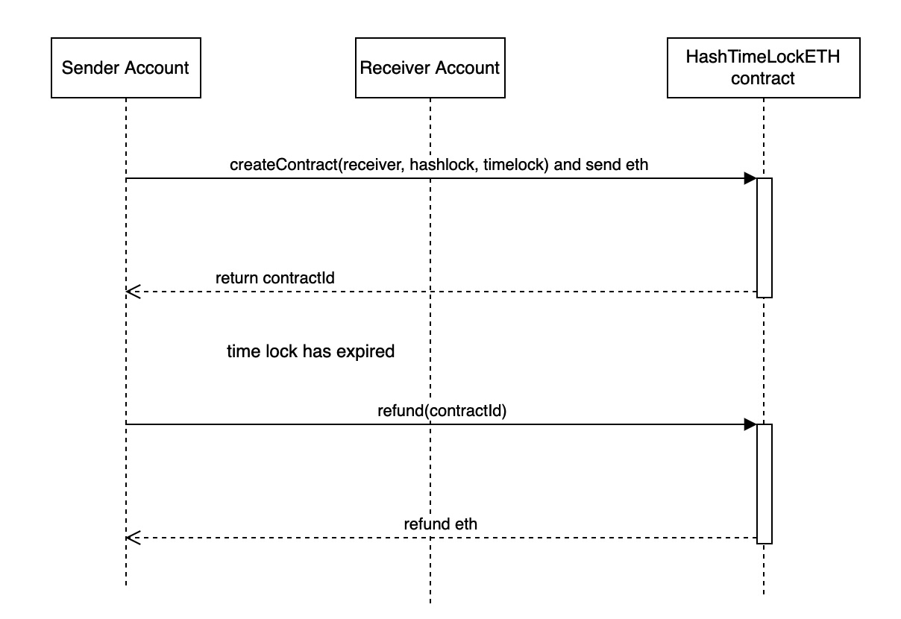
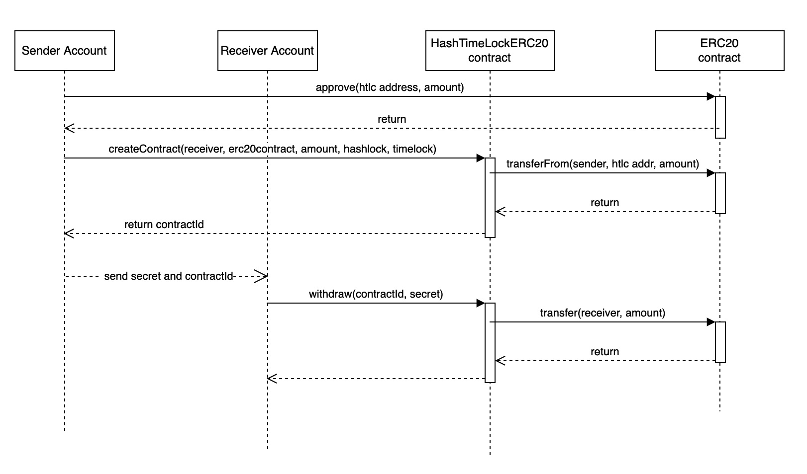
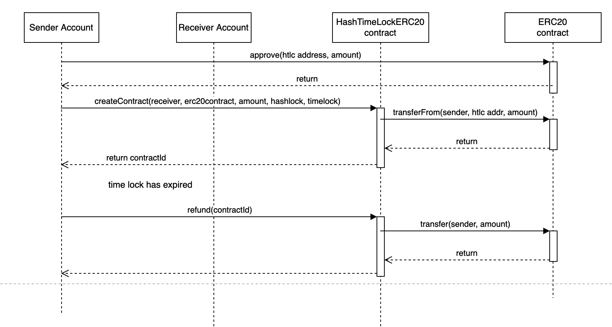

# hashed-time-lock-contract

`Truffle v5.4.10`  
`solc: 0.5.16`

## Run test
```
npm install
npm run ganache
npm test
```
## run web-server 
The project is not fully completed, It mainly completes the interface of the contract. the main code path in web-server/app/service

```
cd web-server
npm install
npm run
```

## The main framework 


## The main flow diagram
### ETH createContract and receiver withdraw


### ETH createContract and sender refund


### ERC20 createContract and receiver withdraw


### ERC20 createContract and sender refund



## TODO
* Complete the web-server according to the business logic
* Increase unit test coverage
* add unit test for web-server
* update solc version
   