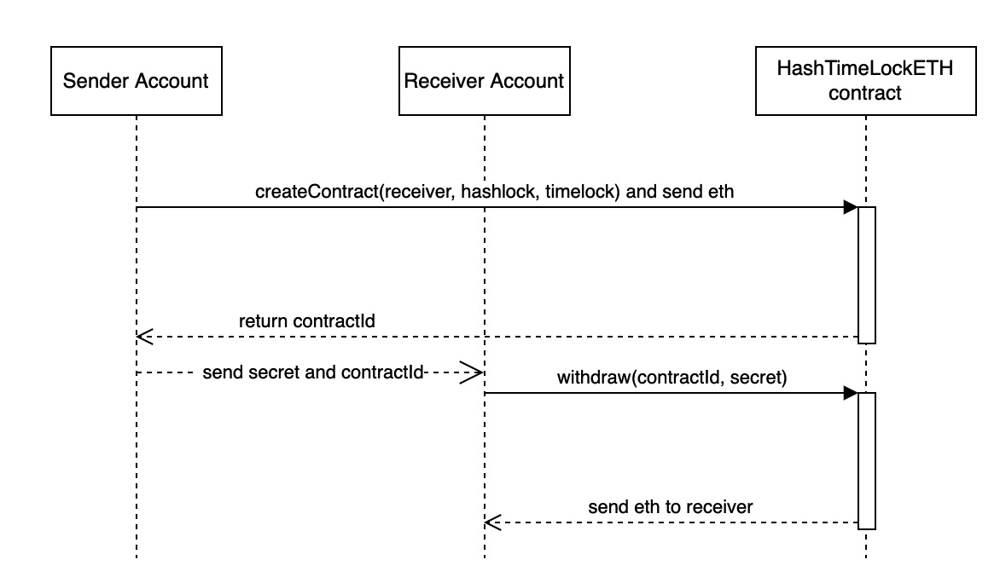

# hashed-time-lock-contract

`Truffle v5.4.10`  
`solc: 0.5.16`

## Run test
```
npm install
npm run ganache
npm test
```
## run web-server 
The project is not fully completed, It mainly completes the interface of the contract. the main code path in web-server/app/service

```
cd web-server
npm install
npm run
```

## The main framework 


## The main flow diagram
### ETH createContract and receiver withdraw


### ETH createContract and sender refund


### ERC20 createContract and receiver withdraw


### ERC20 createContract and sender refund


## The Contract interface
### HashedTimeLockETH
* `createContract(address payable receiver, bytes32 hashlock, uint timelock)` create a eth contract with send eth amount
*  `withdraw(bytes32 contractId, bytes32 secret)` receiver withraw eth with contractId and secret
*  `refund(bytes32 contractId)` refund eth to sender when time lock expiry
*  `getContractDetail(bytes32 contractId)` get info of contract 

### HashedTimeLockERC20
* `createContract(address receiver, address tokenContract, uint256 amount, bytes32 hashlock, uint timelock) ` create a erc20 contract
*  `withdraw(bytes32 contractId, bytes32 secret)` receiver withraw erc20 token with contractId and secret
*  `refund(bytes32 contractId)` refund erc20 token to sender when time lock expiry
*  `getContractDetail(bytes32 contractId)` get info of contract 

### HashedTimeLockERC20
* `createContract(address receiver, address tokenContract, uint256 tokenId, bytes32 hashlock, uint timelock)` create a erc721 contract
*  `withdraw(bytes32 contractId, bytes32 secret)` receiver withraw erc721 token with contractId and secret
*  `refund(bytes32 contractId)` refund erc721 token to sender when time lock expiry
*  `getContractDetail(bytes32 contractId)` get info of contract 

## TODO
* Complete the web-server according to the business logic
* Increase unit test coverage
* add unit test for web-server
* update solc version
   